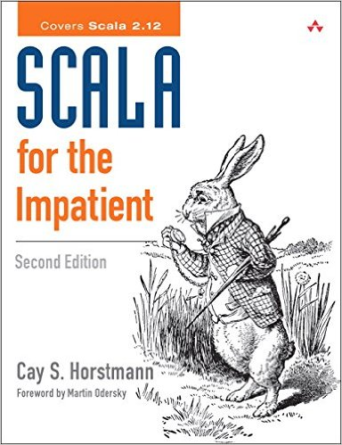
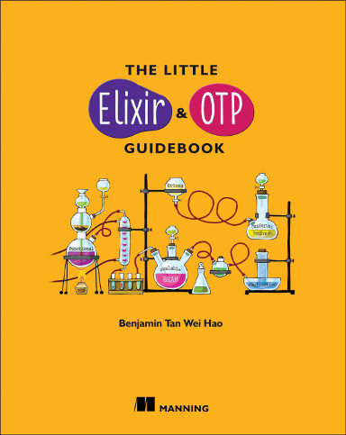

# Book Club

## Current edition

We have *collaboratively* decided to read *Scala for the Impatient* by *Cay Horstmann*:

**You can sign up to the discussion group by [contacting the owner](https://groups.google.com/forum/#!contactowner/functional-miners---book-club).**

If you do not want to buy full book yet, you can find sample of couple first chapters [here](https://info.lightbend.com/ebook-register-scala-for-the-impatient.html). Also you can buy a full book [here](https://www.amazon.com/Scala-Impatient-Cay-S-Horstmann-ebook/dp/B007JWDMIE/).

### Organization

- Remote video calls in *Polish* language.
  - Each *Wednesday* at *<time>9 PM CET / CEST</time>*.
  - Link to the video call is sent via special email group.
- No more than 3 meetings in a row, without longer break (e.g. *2 weeks*).
- We are switching the presenters for each meeting, with upfront notification.
- Presenter shows the chapter and reads it together with participants, including analysis of interesting bits.
- We should finish the book after 12-13 meetings (depending on the tempo).

## Previous editions

### First edition

Previously we have decided to read *The Little Elixir and OTP Guidebook* by *Benjamin Tan Wei Hao*:

We finished reading club for that book around end of *April* in *2017*. If you are still interested, you can buy this book [here](https://www.manning.com/books/the-little-elixir-and-otp-guidebook).
