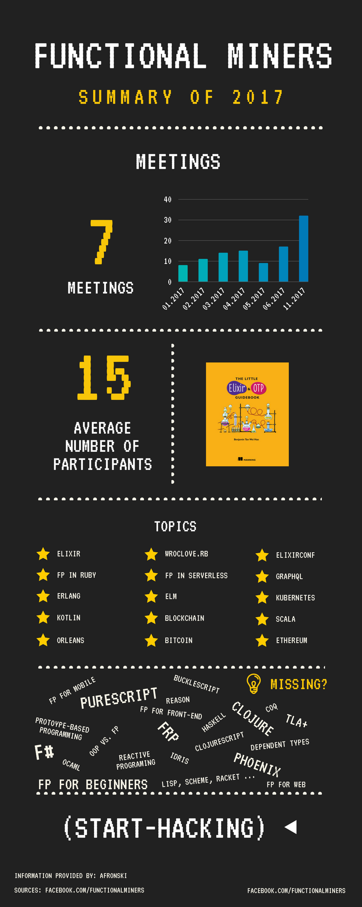

# Hello *&lambda;!*

**Functional Miners** is an IT meet-up organized in *Silesian* region, for people interested in *computer science* topics oriented around *distributed systems*, *functional programming*, *functional languages*, and *programming languages theory* in general.

If we gained your interest, we encourage you to participate in the next event, see details below. If you are still in doubt if that meet-up is for you, feel free to look on summary of our activity from *2017* down below. Also we are organizing a [reading club](/book-club) around aforementioned topics.

We meet regularly on the **4th Tuesday** each quarter at *<time>5:30 PM</time>*, talks start around *<time>6 PM CET / CEST</time>*. Our next meeting is planned as following:

<section>
  <event-details></event-details>
</section>

<section>
  
Help us spread the word in <em>social media</em>:

  <social-buttons></social-buttons>
</section>

You can also ask a direct question here via *Facebook*:

<section>
  <facebook-comments></facebook-comments>
</section>

## Contact

**If you are interested to give a talk on one of following topics, please drop us a line**. We are always looking for speakers in advance. The same goes with topics which you miss on our events - please let us know what talk or workshop we should organize, or what kind of activity we are lacking as a community.

Also, if you are interested in being a *sponsor* of that event - let&#39;s stay in touch.

<section>
  <contact-form></contact-form>
</section>

## Summary of 2017

Our user group started in 2016 and we are active since then. Older events are be available in the archive, feel free to explore them. For those of you who likes more  Below you can find summary of our activity in the 2017:

